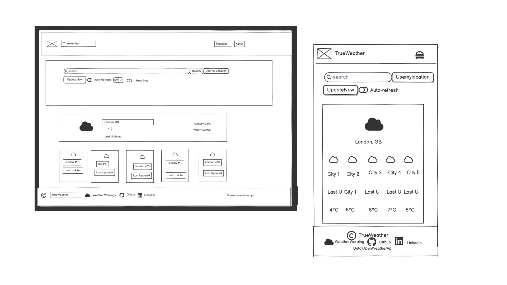
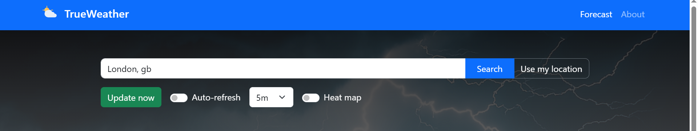
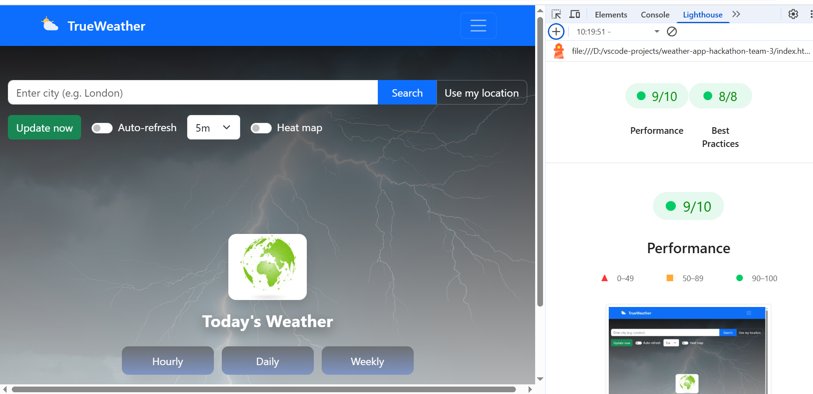

# Weather-App

## Contents

-   [Live Site](#live-site)
-   [Introduction](#introduction)
-   [Responsivity](#responsivity)
-   [User Experience](#user-experience)
-   [Design](#design)
-   [Website Features](#website-features)
-   [Future Features](#future-features)
-   [Technologies Used](#technologies-used)
-   [AI Use](#ai-use)
-   [Deployment](#deployment)
-   [Testing](#testing)
-   [Validation](#validation)
-   [Manual Testing](#manual-testing)
-   [Lighthouse](#lighthouse)
-   [Credits](#credits)

# live-site

https://sveena25.github.io/Weather-App/

# Introduction

Weather App (Hackathon Team 3) is a small responsive web app that shows current weather and a 5-day forecast, displays alerts, and includes an interactive map. Users can search for a city or use geolocation to get weather details (temperature in °C, humidity, wind, and description). The app integrates OpenWeatherMap for weather data and links to Met Office weather warnings for additional advisories.

# Responsivity

The app is built to work across a wide range of screen sizes using Bootstrap's responsive grid and a few custom CSS rules.
The site was fully responsive for mobile, tablet, and desktop. Screenshots of https://ui.dev/amiresponsive running our website shown below.

The map shown at startup resizes dynamically to fit the screen.


## User Experience

### Strategy

Our strategy was to create a weather application that is intuitive, visually engaging, and accessible to users worldwide. We focused on delivering accurate weather information with interactive features such as map integration and dynamic backgrounds.

### Scope

The scope of this project included:

-   Providing real-time weather updates for any city globally.
-   Allowing users to search for locations or use their current geolocation.
-   Displaying weather information visually through cards, interactive map and colour and image changes based on weather conditions.
-   Ensuring the site is responsive and accessible.

Initially, we had thought to add a feature where users could see the weather from any past date (e.g. their location or street address). However, we discovered that the API that provided this infomation was only avaliable on a paid plan, so we pivoted to focus on the visual elements of the site e.g. the map.

### Structure

The structure of the site is simple as it is a one-page website with two navigations forecast and about. It includes a search bar at the top, an interactive heat-map button with auto-refresh under which weather cards are displayed, and buttons to select hourly and daily weather reports with update now button.

### Skeleton

Balsamiq Wireframes were used to plan the layout of the site.



As can be observed above, we had a framework for how we wanted to present the site & its key features.

Although simplistic, the added time allowed us to focus on UX by means of features & interactivity.

### Surface

## Design

From a design perspective, our main goal was to relay information the end-user visually.

To achieve this we included the following features:

-   Interactive map
-   Cards displaying weather information
-   Dynamic background

### Geo-location

within the project scope phase, we deceided to include to means of aqcuiring the users information.

Namely, via a search text field & a geo-location button:



Upon clicking this button, the user is prompted by their respective search engine whether to enable current location.

If accepted, the location is updated & weather information is presented in the form of cards.

Additionally, the search function becomes locked & placeholder text is inserted into the search box to give an indication of where geo-locate has located them.

### API Error Message

If the APIs are not responding, a message is displayed to the user.
This prevents frustration as they have feedback as to what the problem is rather than just encountering a non-working site.

![API Error Message]

### Weather Cards

The site features bootstrap cards that display the current weather and forecast for the next 5 days. The cards are designed to be visually appealing and easy to read, with clear icons and text. Each card has an image that displays a different image based on the weather conditions. The content of the cards are aquired through the OpenWeatherMap API. The cards are dynamically generated with javascript and updated based on user input and location.

There are 2 sections for the weather cards: the current weather section and the forecast section.

The current weather section displays the weather for the location specified by the user on that day.
There are 2 buttons displayed: "Hourly" and "Daily", which allow the user to toggle between hourly and daily forecasts and jumps to the next section.


The forecast section displays the weather forecast depending on which button the user clicks (hourly or daily). For hourly, the weather shows every 3 hours starting from the next slot after the current time.

<!-- 


For daily, the weather shows the next 5 days including today.

 -->
### Scroll to Top Button

Dynamic scroll to top button using JavaScript lets users jump back to the top of the page instantly, making browsing smooth and frustration free.
## Future Features

Implement the ability to navigate/select from the dropdown using keyboard as well as mouse.

Implement a feature to change the weather card images for night time hours.

Add a custom error message for invalid input to the search bar. At the moment if the user types in an invalid input, the error messages that displays is the same one as for an unreposponsive API ("We cannot fetch the weather"). This may cause confusion so we would like to add a custom error message e.g. "Please input a valid city name".

Increase dropdown specificity. Currently, the dropdown displays city names that are closest to the typed input (e.g., "Brista, HR" for "brist"), but not always the intended city (such as "Bristol, GB"). We aim to increase the number of items shown in the dropdown so that the desired city appears even when fewer letters are entered.

Remove the first card from the forecast. Currently the first card in the forecast section is the same as the one in Today's Weather. This may cause confusion, so we aim to remove this card and only display the future weather.

Not exactly a feature, but a wider range of images could be displayed in the cards, like for when it is just cloudy or when it is night time.
## Technologies Used

This site was coded with HTML, CSS, and JavaScript.

**Git** was used for version control.

**[Github](https://github.com/)** was used to save and store the files for the site.

**[Github Pages](https://pages.github.com/)** were used to deploy the site.

**[Github Issues Project Board](https://github.com/features/issues)** was used to track progress.

**[Bootstrap](https://getbootstrap.com/)** Framework (v5.3) was used for the grid structure and responsivity throughout the site.

**[OpenWeatherAPI](https://openweathermap.org/forecast5)** was used to retrieve the 5 day weather forecast.

**[OpenWeatherAPI - Geocoding](https://openweathermap.org/api/geocoding-api)** was used to retrieve co-ordinates for locations.

**[OpenStreetMapAPI](https://www.openstreetmap.org/)** was used to convert coordinates to plain text.

**[MapboxAPI](https://www.mapbox.com/)** was used to display the map.

**[WebAIM](https://webaim.org/resources/contrastchecker/)** was used to check the colour contrast for accessibility.

**[Sqoosh](https://squoosh.app/)** was used to compress images for the web.

**[Microsoft Copilot](https://copilot.microsoft.com/)** was used for image generation and debugging (see AI use section).

**[Chrome DevTools](https://developer.chrome.com/docs/devtools)** were used for debugging and testing.

**[W3 HTML Validator](https://validator.w3.org/)** was used for HTML validation.

**[W3 CSS Validator](https://validator.w3.org/)** was used for CSS validation.

### AI Use

#### Image Generation

The images for the weather cards were generated using Copilot including images for sun, drizzle, rain, snow, clouds, and extreme weather.

#### Code Generation

One way in which AI assisted us on this project was in code generation, specifically the background styles.

Initial Idea
I wanted my weather app should be interactive with basic technologies to give results based on city names. I asked the AI for help deciding on to fetch the weather data.

Prompt: “I’m trying to make a weather app that gives the weather data based on location depending on the weather – can you help me decide the app?”

Response: The AI suggested a weather app with search locations.

CSS Implementation
Next, I asked for actual CSS to implement these backgrounds with smooth transitions.

Prompt: “Can you provide the CSS for this? I’m thinking fades for each?”

Response: The AI generated a full CSS setup using data-weather attributes, gradients, variables for text colour, and transition effects.

...

#### Debugging

While integrating Mapbox’s new rain effect (map.setRain()), I ran into a recurring error:

Leaflet map could not be initialized ReferenceError: L is not defined
    at initMap (app.js:343:5)
    at HTMLDocument.

This happened while integrating the maps  I used an AI assistant to help isolate the cause and propose fixes. Here’s what came out of that process:

Problem Identified

Load Leaflet from a local copy instead of CDN if you prefer offline or locked dependencies.
Add a visual loading indicator while the map assets download.
Keep the dynamic loader as a fallback and add static includes in

Key Fixes

1. Load Leaflet from a local copy instead of CDN if you prefer offline or locked dependencies.

2. OAdd a visual loading indicator while the map assets download

3. Keep the dynamic loader as a fallback and add static includes in index.html for performance


Copilot was also used to troubleshoot when the site was not storing the last saved search correctly in local storage. It pointed out that localStorage.setItem() was not being called in the right place, and made suggestions for how to correct this.

## Deployment

This site was deployed using Github Pages.

From the github repository, we navigated to the Pages area. Within this area, the "main" branch was chosen for deployment.

Github Pages then provides a link to the deployed site.

## Local setup: OpenWeatherMap API key

This project expects an OpenWeatherMap API key to be available to the frontend via `config.local.js`.
Instead of committing a key, you can generate `config.local.js` from an environment variable.

Options:

- PowerShell (Windows): set the environment variable and run the helper script:

```powershell
$Env:OPENWEATHER_API_KEY = 'your_real_key_here'
.\scripts\generate-config.ps1
```

- Node (cross-platform): set the env var and run the Node script:

```bash
OPENWEATHER_API_KEY=your_real_key_here node scripts/generate-config.js
# on Windows PowerShell you can also use:
$Env:OPENWEATHER_API_KEY='your_real_key_here'; node scripts/generate-config.js
```

The scripts will create (or overwrite) `config.local.js` at the project root with the single line:

```js
window.OPENWEATHER_API_KEY = 'your_real_key_here';
```

There's a sample env file at `.env.example` showing the expected name: `OPENWEATHER_API_KEY`.

## Testing

### Validation

#### HTML

[W3 HTML Validator](https://validator.w3.org/)


#### CSS

[W3 CSS Validator](https://validator.w3.org/)


### Manual Testing

If map doesn't load and console shows CORS or mixed-content errors, verify you are serving over HTTP (or HTTPS) consistently and that tile URLs are HTTPS.

If the One Call API fails, confirm the API key has the correct permissions (One Call may require an appropriate plan or correct endpoint)

If dynamic Leaflet load fails due to blocked CDN, consider adding static link and script tags for Leaflet to index.html or host a local copy

#### Responsivity & Browsers

Site on mobile/tablet/desktop: 1 card was displayed on mobile, 3 on tablet, 4 on desktop as expected. Buttons work on all. Map scales to fit.

Site viewed on Edge, Safari & Chrome: as expected.

#### Search Functions

Type different city names: weather displayed correctly for each.

Pressed enter to search: search worked.

Clicked on UpdateNow: Updates with current timestamp.

Auto-refresh button refreshes the weather and gives the current weather.

Empty location input: Error message ("Please enter a city name") was displayed. Although this does provide some feedback, it would be better to handle invalid input separately to API issues (see future features).

Search with internet off/API not responding: Error message displayed as expected.

#### Default Location

Previously searched: Shows weather and map for previously searched location as expected.

Without local storage/no previous search: Displays weather and map for London as expected.

#### Buttons

Hourly & Daily buttons: Change the weather cards to the rest of the day, or rest of the week as expected. The first card displayed in the forecast is the same as today's weather, which may be confusing.

Use My Location & Reset buttons: Displays map and weather for your location as expected. Sometimes innaccurate (close to location but not exact) due to ISP and API.

#### Images and Background

Images are generated using AI Copilot.

#### Map

Map: Toggle heat map works, buttons to the side work as expected (zoom and tilt). Map navigates to the location you search for, or your location when you select choose my location.

### Accessibility

The site can be tabbed through in a logical order.

Keyboard navigation: Available for search and buttons. Not implemented in dropdown (see future features).

Screen Readers: Headings are in a logical order. Aria-labels present for input, scroll button, and cards. Buttons labelled clearly.

All colours pass the WCAG standards. There is just one colour combination that fails: the header with the rain background which has insufficient contrast.

### Lighthouse

#### Performance





Most of the fall in the lighthouse performance scores can be attributed to the mapbox integration, which is quite resource-intensive.

## Credits

[Copilot](https://copilot.microsoft.com/) - used for image generation (see AI use section)

[Balsamiq](https://balsamiq.com/) - used to create wireframes.


